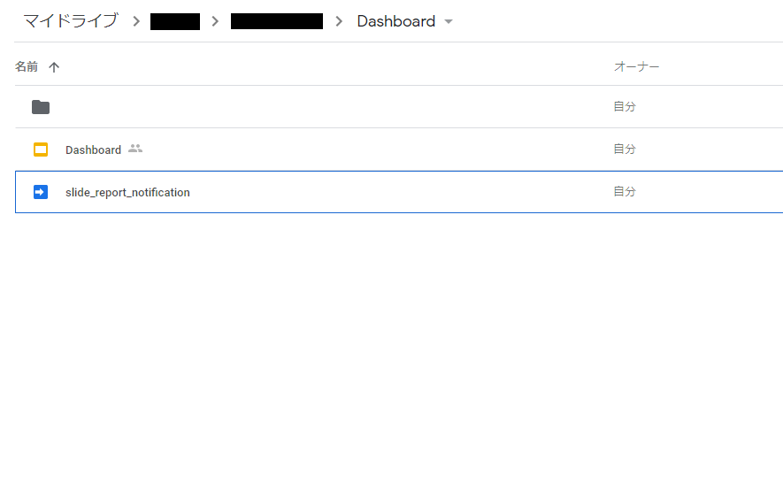
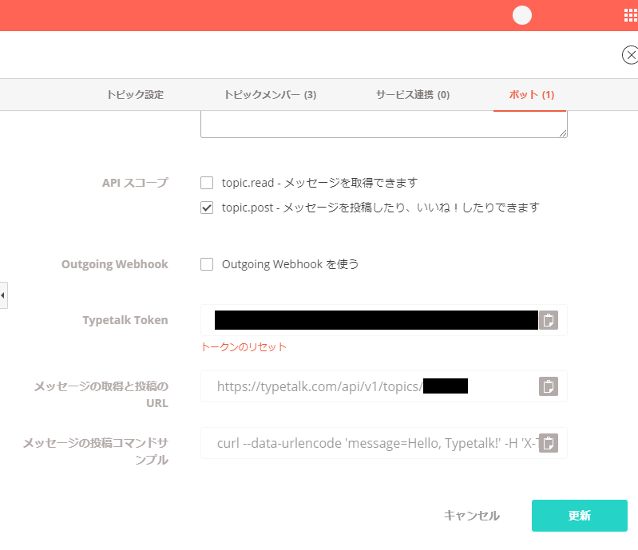
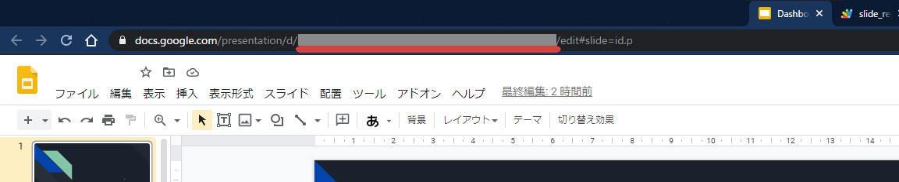
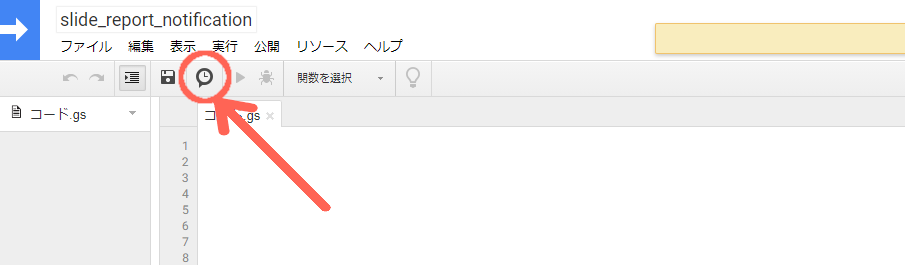
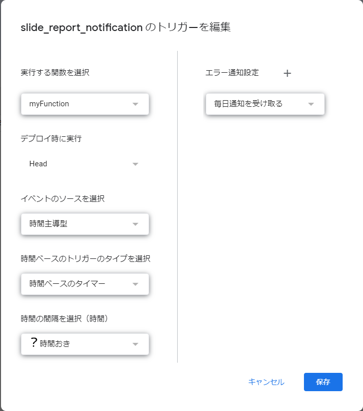

# How to setup

1. 通知したいスライドと同じディレクトリに適当な名前でGAS(Google Apps script)を作成する

2. Typetalkのボットの設定を画像のように設定をする

- Typetalk Tokenとメッセージ取得と投稿のURLは後で使うのでメモしておく

3. GoogleスライドのIDを取得する(赤線の箇所)

4. 作成したGASに../notificator.jsの中身をコピペする

5. 各種情報を../notificator.jsに記述する
- `[[YOUR_BOT_TOKEN]]`
    - Typetalk Tokenの値
- `[[YOUR_CHANNEL_ID_URL]]`
    - メッセージ取得と投稿のURL
- `[[YOUR_SLIDE_ID]]`
    - GoogleスライドのIDの値
- `[[YOUR_NAME]]`
    - Typetalkに投稿されるメッセージでの表示名

6. GASの時計ボタン(現在のプロジェクトのトリガー)を押して定期実行の設定をする

